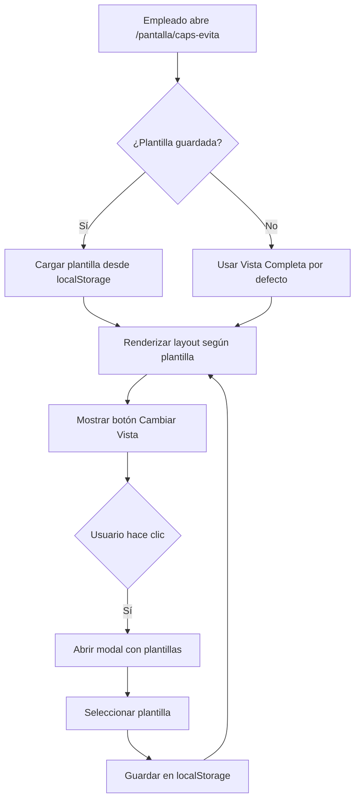

# Sistema de Pantalla Pública Multi-Servicio ✅ IMPLEMENTADO

## 📋 Contexto

En instituciones como CAPS, múltiples servicios llaman pacientes simultáneamente:
- **Enfermería** (toma de presión)
- **Vacunación**
- **Laboratorio**
- **Consultorios médicos** (varios profesionales)
- **Farmacia**
- **Admisión**

Cada servicio puede tener uno o más consultorios/salas asignados.

**Estado:** ✅ Sistema completamente implementado y funcional

## 🎯 Requisitos

### Funcionales
1. **Vista por Servicio**: Mostrar solo llamados relevantes a cada servicio
2. **Vista General**: Mostrar todos los llamados de la institución
3. **Filtrado en Tiempo Real**: Actualización automática por servicio
4. **TTS Selectivo**: Solo anunciar llamados del servicio actual (en vista por servicio)
5. **Historial Reciente**: Últimos 10-20 llamados por servicio
6. **Identificación Clara**: Color/icono por tipo de servicio

### No Funcionales
1. **Performance**: Carga rápida (< 2s)
2. **Real-time**: Actualización < 500ms
3. **Escalabilidad**: Soportar 10+ servicios simultáneos
4. **Accesibilidad**: Legible a 5+ metros de distancia

## 🏗️ Arquitectura Implementada ✅

### Sistema de Plantillas Configurables (Implementado)

**Concepto:** Un único endpoint con sistema de plantillas que permite diferentes layouts configurables.

```
/pantalla/[institution_slug] → Vista única con plantilla seleccionable
```

**Características Implementadas:**
- ✅ Selector de plantilla con botón flotante "Cambiar Vista"
- ✅ 4 plantillas predefinidas del sistema
- ✅ Persistencia de selección en localStorage
- ✅ Cambio de vista sin recargar página
- ✅ Perfecto para empleados no capacitados

### Plantillas Disponibles

1. **Vista Completa (Grid 3x2)** - Predeterminada
   - Muestra todos los servicios en grilla 3x2
   - Ideal para sala de espera principal
   - TTS con nombre de servicio

2. **Grilla Compacta (Grid 2x2)**
   - Muestra todos los servicios en grilla 2x2
   - Ideal para espacios reducidos
   - TTS con nombre de servicio

3. **Lista Vertical**
   - Vista detallada con cards grandes
   - Ideal para pantallas verticales
   - Muestra llamado actual + próximos por servicio

4. **Carrusel Automático**
   - Rotación automática cada 8 segundos
   - Controles de pausa/navegación
   - Indicadores de progreso

### Flujo de Usuario (Implementado)



## 🎨 Diseño UI Implementado ✅

### Vista Grid 3x2 (Predeterminada)

```
┌────────────────────────────────────────────────────────┐
│  CAPS B° Evita - Pantalla General    🔊 [TTS Controls] │
├────────────────────────────────────────────────────────┤
│                                                        │
│  ┌─────────────┐ ┌─────────────┐ ┌─────────────┐     │
│  │ 💉 VACUNACIÓN│ │ 🩺 ENFERMERÍA│ │ 🧪 LABORATORIO│    │
│  │─────────────│ │─────────────│ │─────────────│     │
│  │ LLAMADO:    │ │ LLAMADO:    │ │ ESPERANDO   │     │
│  │ Juan Pérez  │ │ Ana García  │ │             │     │
│  │ Sala 1      │ │ Sala 2      │ │             │     │
│  │             │ │             │ │             │     │
│  │ ESPERANDO:  │ │ ESPERANDO:  │ │ PRÓXIMOS:   │     │
│  │ - M. López  │ │ - C. Ruiz   │ │ - P. Silva  │     │
│  │ - L. Torres │ │ - D. Gómez  │ │ - R. Díaz   │     │
│  └─────────────┘ └─────────────┘ └─────────────┘     │
│                                                        │
│  ┌─────────────┐ ┌─────────────┐ ┌─────────────┐     │
│  │ 👨‍⚕️ MÉDICO 1 │ │ 👨‍⚕️ MÉDICO 2 │ │ 💊 FARMACIA  │     │
│  │ Dr. Martínez│ │ Dra. Sánchez│ │─────────────│     │
│  │─────────────│ │─────────────│ │ EN CONSULTA │     │
│  │ LLAMADO:    │ │ LLAMADO:    │ │             │     │
│  │ S. Romero   │ │ P. Castro   │ │ PRÓXIMOS:   │     │
│  │ Cons. 3     │ │ Cons. 4     │ │ - E. Vega   │     │
│  └─────────────┘ └─────────────┘ └─────────────┘     │
│                                                        │
│  Última actualización: 14:30:15                       │
└────────────────────────────────────────────────────────┘
```

### Vista Lista Vertical

```
┌────────────────────────────────────────────────────────┐
│  CAPS B° Evita                      [Cambiar Vista 🔧] │
├────────────────────────────────────────────────────────┤
│                                                        │
│  ┌──────────────────────────────────────────────────┐ │
│  │ 💉 Vacunación                                    │ │
│  ├──────────────────────────────────────────────────┤ │
│  │  🔔 LLAMADO ACTUAL      │  PRÓXIMOS (3)          │ │
│  │  Juan Pérez             │  1. María López        │ │
│  │  Sala 1                 │  2. Luis Torres        │ │
│  │                         │  3. Carmen Ruiz        │ │
│  └──────────────────────────────────────────────────┘ │
│                                                        │
│  ┌──────────────────────────────────────────────────┐ │
│  │ 🩺 Enfermería                                    │ │
│  ├──────────────────────────────────────────────────┤ │
│  │  🔔 LLAMADO ACTUAL      │  PRÓXIMOS (5)          │ │
│  │  Ana García             │  1. Pedro Silva        │ │
│  │  Sala 2                 │  2. Rosa Díaz          │ │
│  │                         │  ... +3 más            │ │
│  └──────────────────────────────────────────────────┘ │
│                                                        │
│  Última actualización: 14:30:15                       │
└────────────────────────────────────────────────────────┘
```

## 💾 Estructura de Datos Implementada ✅

### Tabla de Plantillas (display_template)

```sql
CREATE TABLE display_template (
  id UUID PRIMARY KEY,
  name VARCHAR(100) NOT NULL,
  description TEXT,

  -- Tipo de layout
  layout_type VARCHAR(20) CHECK (layout_type IN ('grid-2x2', 'grid-3x2', 'list', 'carousel')),

  -- Filtrado de servicios
  service_filter_type VARCHAR(20) CHECK (service_filter_type IN ('all', 'specific')),
  service_ids UUID[] DEFAULT '{}',

  -- Configuración
  carousel_interval INTEGER DEFAULT 8,
  is_predefined BOOLEAN DEFAULT false,
  is_active BOOLEAN DEFAULT true,

  created_at TIMESTAMPTZ DEFAULT now(),
  updated_at TIMESTAMPTZ DEFAULT now(),
  created_by UUID REFERENCES auth.users(id)
);
```

### Query de Appointments (Sin Cambios)

```typescript
// La query principal sigue siendo la misma
const { data } = await supabase
  .from('appointment')
  .select(`
    id,
    scheduled_at,
    status,
    patient:patient_id(first_name, last_name),
    professional:professional_id(first_name, last_name),
    service:service_id(id, name),
    room:room_id(id, name)
  `)
  .eq('institution_id', institutionId)
  .gte('scheduled_at', startOfDay)
  .lte('scheduled_at', endOfDay)
  .in('status', ['esperando', 'llamado', 'en_consulta'])
  .order('scheduled_at', { ascending: true })
```

### Agrupación por Servicio (Cliente)

```typescript
// lib/group-appointments.ts
export function groupAppointmentsByService(appointments) {
  const grouped = appointments.reduce((acc, apt) => {
    const serviceName = apt.service_name
    if (!acc[serviceName]) {
      acc[serviceName] = []
    }
    acc[serviceName].push(apt)
    return acc
  }, {})

  return Object.entries(grouped)
    .map(([serviceName, appointments]) => ({
      serviceName,
      appointments: appointments.sort((a, b) => {
        // Prioridad: llamado > en_consulta > esperando
        const statusPriority = { 'llamado': 0, 'en_consulta': 1, 'esperando': 2 }
        // ... ordenamiento
      })
    }))
    .sort((a, b) => a.serviceName.localeCompare(b.serviceName))
}
```

### Realtime (Sin Cambios)

```typescript
// Mismo canal para toda la institución
supabase
  .channel(`institution-${institutionId}-appointments`)
  .on('postgres_changes', {
    event: '*',
    schema: 'public',
    table: 'appointment',
    filter: `institution_id=eq.${institutionId}`
  }, handleUpdate)
  .subscribe()
```

## 🔊 Sistema TTS Inteligente Implementado ✅

### Detección Automática de Múltiples Servicios

```typescript
// Detecta si hay más de un servicio activo
const hasMultipleServices = useMemo(() => {
  const services = new Set(appointments.map(apt => apt.service_name))
  return services.size > 1
}, [appointments])
```

### Generación de Texto Adaptativo

```typescript
// lib/audio-utils.ts
export function generateCallText(
  patientName: string,
  roomName: string,
  serviceName?: string
): string {
  const cleanRoomName = roomName.replace(/^consultorio\s*/i, '').trim()

  // Si hay servicio, incluirlo en el anuncio
  if (serviceName) {
    return `${serviceName}: ${patientName}, ${cleanRoomName}`
  }

  return `${patientName}, consultorio ${cleanRoomName}`
}
```

### Comportamiento según Contexto

**Escenario 1: Un solo servicio activo**
```
TTS: "Juan Pérez, consultorio 3"
```

**Escenario 2: Múltiples servicios activos**
```
TTS: "Vacunación: Juan Pérez, sala 1"
TTS: "Enfermería: Ana García, sala 2"
TTS: "Laboratorio: Pedro Silva, sala 4"
```

### Implementación en PublicScreenTTS

```typescript
<PublicScreenTTS
  callEvents={callEvents}
  enabled={ttsEnabled}
  volume={ttsVolume}
  rate={ttsRate}
  includeServiceName={hasMultipleServices}  // ← Detección automática
/>
```

## 🎨 Sistema de Colores por Servicio

```typescript
const serviceColors: Record<string, { bg: string; text: string; icon: string }> = {
  'vacunacion': {
    bg: 'bg-purple-100',
    text: 'text-purple-900',
    icon: '💉'
  },
  'enfermeria': {
    bg: 'bg-blue-100',
    text: 'text-blue-900',
    icon: '🩺'
  },
  'laboratorio': {
    bg: 'bg-teal-100',
    text: 'text-teal-900',
    icon: '🧪'
  },
  'medico': {
    bg: 'bg-green-100',
    text: 'text-green-900',
    icon: '👨‍⚕️'
  },
  'farmacia': {
    bg: 'bg-orange-100',
    text: 'text-orange-900',
    icon: '💊'
  },
  'default': {
    bg: 'bg-gray-100',
    text: 'text-gray-900',
    icon: '📋'
  }
}
```

## 📱 Casos de Uso

### Caso 1: CAPS con 5 Servicios
**Setup:**
- 1 tablet en sala de espera → Vista general (todas)
- 1 tablet en vacunación → Vista servicio (solo vacunación)
- 1 tablet en enfermería → Vista servicio (solo enfermería)

**URLs:**
```
Sala espera: /pantalla/caps-evita
Vacunación:  /pantalla/caps-evita/servicio/[vacunacion-id]
Enfermería:  /pantalla/caps-evita/servicio/[enfermeria-id]
```

### Caso 2: Hospital con Múltiples Consultorios
**Setup:**
- Pantalla LED grande en hall → Vista general (grid)
- TV en cada consultorio → Vista servicio individual

## 🚀 Estado de Implementación

### ✅ Fase 1: Base de Datos y Estructura (COMPLETADO)
- ✅ Migración `002_create_display_templates.sql` ejecutada
- ✅ Tabla `display_template` creada con RLS policies
- ✅ 4 plantillas predefinidas insertadas
- ✅ Función `groupAppointmentsByService()` implementada

### ✅ Fase 2: Componentes de Layout (COMPLETADO)
- ✅ `ServiceCard` - Tarjeta reutilizable por servicio
- ✅ `GridLayout` - Grid 2x2 y 3x2 configurable
- ✅ `ListLayout` - Vista vertical detallada
- ✅ `CarouselLayout` - Rotación automática con controles
- ✅ Sistema de colores automático (15+ tipos)
- ✅ Iconos emoji por categoría de servicio

### ✅ Fase 3: Integración y UX (COMPLETADO)
- ✅ `TemplateSelector` - Modal simple para cambiar vista
- ✅ `MultiServiceDisplay` - Wrapper que renderiza layouts
- ✅ Persistencia en localStorage por institución
- ✅ Botón flotante "Cambiar Vista"

### ✅ Fase 4: TTS Inteligente (COMPLETADO)
- ✅ Detección automática de múltiples servicios
- ✅ TTS adaptativo según contexto
- ✅ Inclusión de nombre de servicio cuando corresponde
- ✅ Testing manual exitoso

### ⏳ Pendiente (Opcional)
- ⏳ Panel super admin para crear plantillas personalizadas
- ⏳ Filtrado por servicios específicos en plantillas custom
- ⏳ Testing con datos reales de producción

## 📊 Resultado Final

**Tiempo Real:** ~8 horas de desarrollo
**Complejidad:** Media-Alta (por sistema de plantillas)
**Estado:** ✅ **COMPLETADO Y FUNCIONAL**
**Impacto:** Alto - Sistema flexible y fácil de usar

## 🔧 Consideraciones Técnicas

### Performance
- Usar `useMemo` para agrupaciones
- Implementar virtualización si > 50 appointments
- Limitar historial a últimos 20 por servicio

### Accesibilidad
- Fuentes grandes (24px+ para llamado actual)
- Alto contraste (WCAG AAA)
- Animaciones suaves para nuevos llamados
- TTS configurable por servicio

### Multi-tenant
- Cada institución configura sus servicios
- Colores personalizables por institución
- Iconos personalizables (futuro)

## ✅ Beneficios Logrados

1. **Simplicidad:** Empleados sin capacitación pueden cambiar vistas fácilmente
2. **Flexibilidad:** 4 layouts diferentes para distintos escenarios
3. **Escalabilidad:** Soporta ilimitados servicios sin cambios de código
4. **UX Superior:** TTS inteligente que adapta anuncios al contexto
5. **Performance:** Agrupación eficiente con useMemo y optimización client-side
6. **Mantenibilidad:** Sistema de colores automático sin configuración manual

## 📁 Archivos Implementados

### Base de Datos
- `db/migrations/002_create_display_templates.sql` - Migración ejecutada ✅

### Componentes Principales
- `components/multi-service-display.tsx` - Wrapper principal
- `components/template-selector.tsx` - Selector de plantillas
- `components/service-card.tsx` - Tarjeta por servicio
- `components/public-screen-tts.tsx` - TTS adaptativo (modificado)

### Layouts
- `components/layouts/grid-layout.tsx` - Grid 2x2 y 3x2
- `components/layouts/list-layout.tsx` - Vista vertical
- `components/layouts/carousel-layout.tsx` - Carrusel automático

### Utilidades
- `lib/service-colors.ts` - Sistema de colores automático
- `lib/group-appointments.ts` - Agrupación por servicio
- `lib/audio-utils.ts` - Generación texto TTS (modificado)

### UI Components (shadcn/ui)
- `components/ui/radio-group.tsx` - Para selector de plantillas
- `components/ui/dialog.tsx` - Modal del selector

### Páginas Modificadas
- `app/(public)/pantalla/[slug]/page.tsx` - Integración completa

## 🎓 Guía de Uso

### Para Empleados

1. Abrir `/pantalla/caps-b-evita` (o el slug de su institución)
2. Click en botón "Cambiar Vista" (esquina superior derecha)
3. Seleccionar plantilla deseada:
   - **Vista Completa** → Sala de espera con muchos servicios
   - **Grilla Compacta** → Pantallas pequeñas
   - **Lista Vertical** → Pantallas altas/verticales
   - **Carrusel** → Rotación automática
4. Click "Aplicar Vista"
5. ¡Listo! La selección se guarda automáticamente

### Para Super Admins (Futuro)

Panel de administración para:
- Crear plantillas personalizadas
- Filtrar servicios específicos
- Configurar intervalos de carrusel
- Asignar plantillas por defecto

## 🐛 Troubleshooting

**Problema:** La plantilla no se guarda
- **Solución:** Verificar que localStorage esté habilitado en el navegador

**Problema:** TTS no anuncia el servicio
- **Solución:** Verificar que haya más de un servicio activo (detección automática)

**Problema:** Carrusel no rota automáticamente
- **Solución:** Verificar que carousel_interval esté configurado en la plantilla

## 📝 Notas Finales

Este sistema fue diseñado específicamente para:
- ✅ Empleados públicos sin capacitación técnica
- ✅ Instituciones con 1-20+ servicios simultáneos
- ✅ Diferentes tipos de pantallas (grandes, pequeñas, verticales)
- ✅ Contexto de salud pública argentina (CAPS/Hospitales)

**Documentación actualizada:** 2025-10-03
**Estado:** Producción Ready ✅
